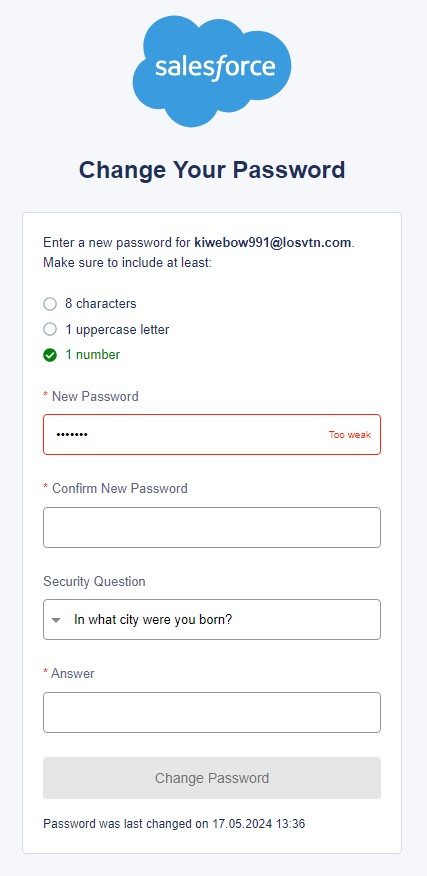

# salesforce: Change Your Password

Formulář pro změnu hesla s vizuální validací input polí.

- [Počáteční vize a cíle](#počáteční-vize-a-cíle)
- [Abstrakt](#abstrakt)
- [Rozsah a realizace](#rozsah-a-realizace)
- [Ukázka](#ukazka)

## Počáteční vize a cíle
Hlavním cílem bylo naprogramovat logiku formuláře s vizuální validací pro input pole a zajištěním, že heslo splňuje požadovaný formát. To vše s využitím znalostí Reactu a TypeScriptu.

## Abstrakt
Formulář lze odeslat, jsou-li všechna pole správně vyplněná, jinak button pro odeslání má atribut `disabled`. Každé pole má svou funkci `onChange` pro validaci, která se provádí souběžně s tím, jak uživatel píše text.

- **New Password**: musí splňovat všechny 3 podmínky formátu. Výchozí barva podmínky nebo dokud není validní je šedá, jakmile je splněná, je zelená.
Pokud heslo nesplňuje některou z podmínek formátu, border textového inputu je červený se zprávou "*Too weak*, po splnění, je zelený se zprávou "*Good*".

- **Confirm New Password**: musí se shodovat s New Password. Dokud není tato podmínka splněna, textový input bude mít border červený se zprávou "*Passwords don't match*". Po splnění shody je zelený se zprávou "*Match*".

- **Security Question**: má vybranou výchozí otázku, kterou lze pomocí rozbalovací nabídky změnit. Pokud je vyplněno pole **Answer** a uživatel vybere jinou otázku, text v input Answer se smaže.

- **Answer**: nesmí zůstat prázdné.

- **Button**: jsou-li všechny inputy správně vyplněné, button změní svůj stav `disabled` na `true` a lze jej odeslat.

Po odeslání formuláře se zobrazí notifikační zpráva o úspěšném odeslání a dojde k nastavení dat formuláře na výchozí hodnoty.

## Rozsah a realizace
Stručný výčet znalostí, které jsem využila. *Uvádím znalosti týkající se Reactu, které jsem využila v kombinaci s TypeScriptem. HTML/CSS jsem převzala - mým cílem nebylo procvičovat kódování.*

- rozdělení aplikace na menší celky do **komponent**
- práce s **useState** a událostí **onChange**, **onClick**
- **formulářové prvky** a **obousměrný data binding**
- **useEffect** se závislostmi
- **komunikace mezi komponentami**
- použití hotové **React knihovny** ([React Icons](https://react-icons.github.io/react-icons/), [React-Toastify](https://www.npmjs.com/package/react-toastify))

## Ukázka
